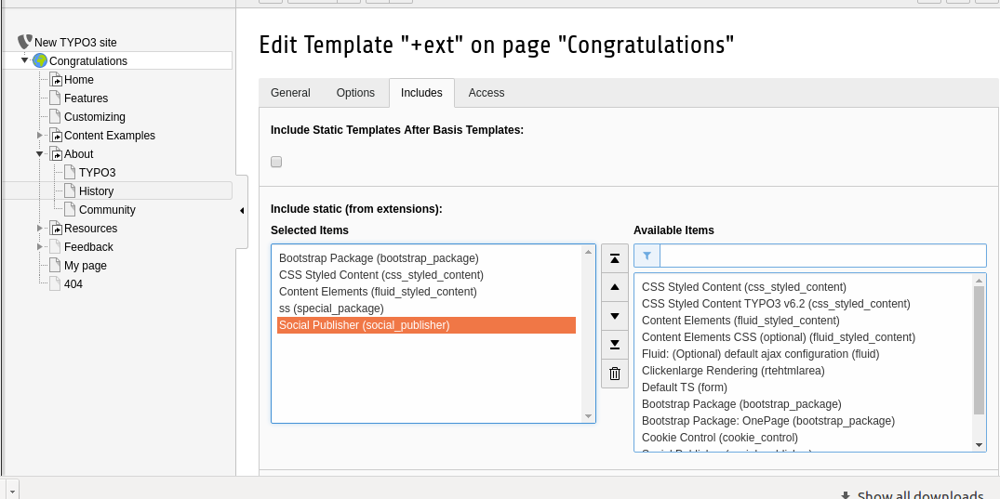

.. ==================================================
.. FOR YOUR INFORMATION
.. --------------------------------------------------
.. -*- coding: utf-8 -*- with BOM.

.. include:: ../Includes.txt

.. _admin-manual:

Installation Manual
====================

Installing this extension is fairly easy. Just download it via the Extension Manager (EM) and click on the install button. Add the static template 'Social Publisher' in the root template.

