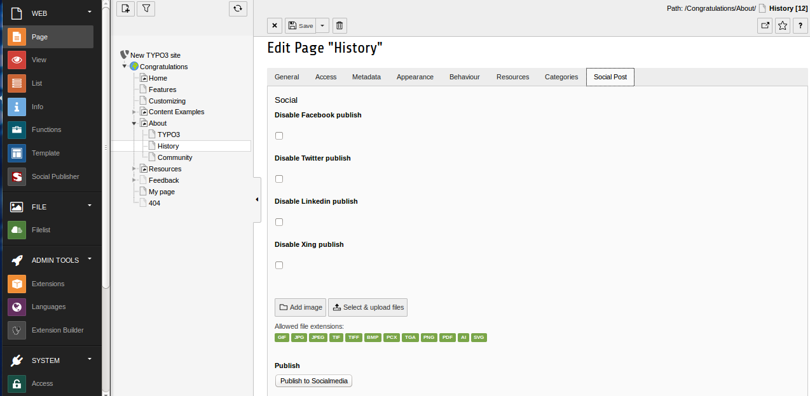

.. ==================================================
.. FOR YOUR INFORMATION
.. --------------------------------------------------
.. -*- coding: utf-8 -*- with BOM.

.. include:: ../Includes.txt

.. _howto:

How to Publish a page
=====================

To publish a page to the configured social medias go to edit page section, you can a find a new tab called 'Social Post'. Here you will get the option to add a custom image for sharing and also you can disable this page from publishing to a particular social media. If you need to add a description with the shared content enter the content in the field 'Description' under metadata tab. After making necessary changes save the page. 

Click on the button 'Publish to Socialmedia' under the tab 'Social Post', this will publish the content to the configured social media.

	Here You can publish the page content to social medias.	